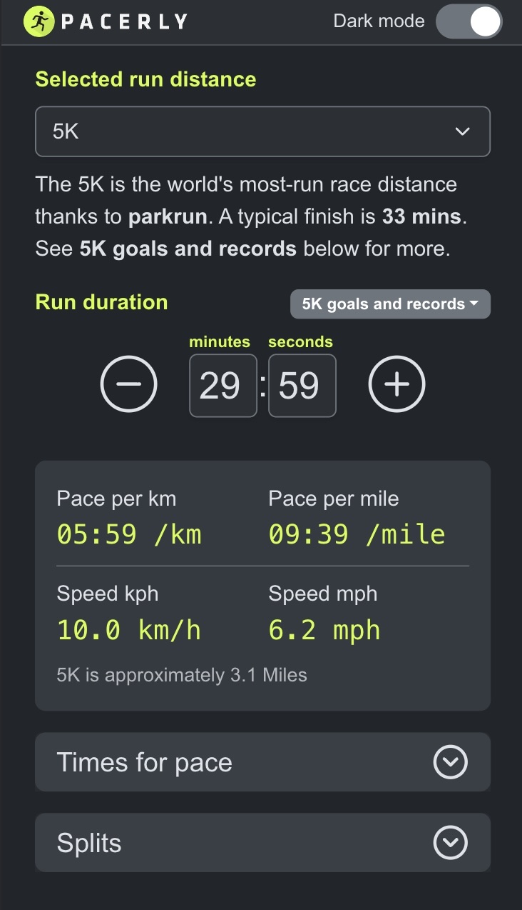
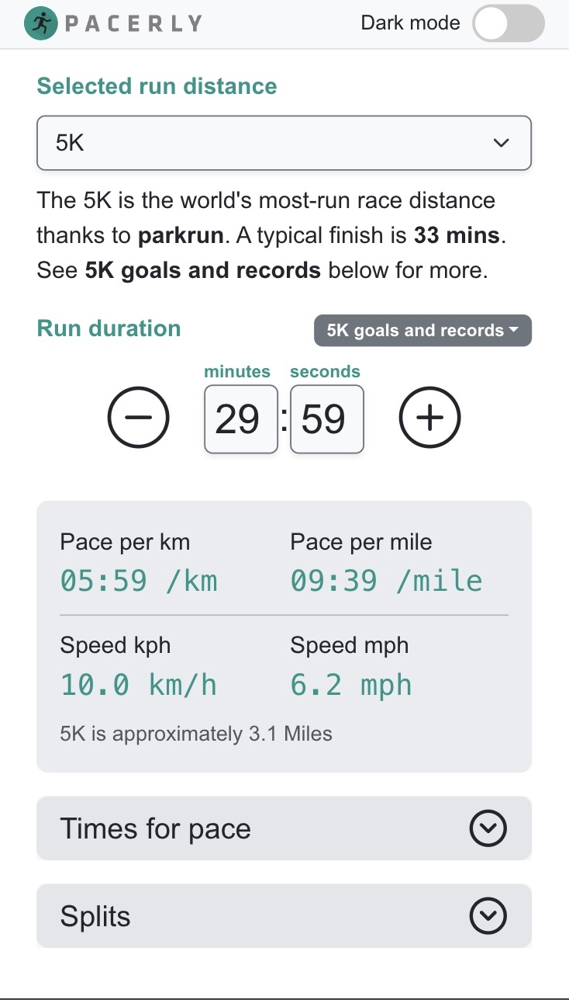

# Pacerly

An open source running pace calculator that aims to solve issues I had with other pace calculators.

|                         Dark                         |                         Light                          |
| :--------------------------------------------------: | :----------------------------------------------------: |
|  |  |

## Goals

### Immediately useable by anyone on first visit

Starts with a default 5K with reasonable time and description and goals and record picker to help choosing a time. Advanced metrics are collapsed by default.

### Easy editing

- Any number entry is separate (e.g. separate hours and minutes) so you can jump to the unit you want.
- Auto-skip through to the next field for quick text entry.
- Spinner buttons that can be held to allow for fine tweaking of time, with immediate effect on other distances — e.g. expanding the Times for Pace.

### Avoid getting lost in calculations

- Always show kilometers and miles so the user doesn't have to switch. This goes for paces, speeds, and splits where it makes sense.
- Record and goal pickers to always get back to a sensible calculation.
- Tool tip when going beyond world record pace and boundaries of times.

### Advanced features

- Middle-distance and track events adjust their splits. E.g. 1500m shows the first 300m split and then the 400s after, with a quick summary: _"First 300m in 66 seconds · 400m laps in 88 seconds"_.
- Separate custom modes for road and track, because the splits logic is different.

### Stand-out features

- Lists of records per event for quick selection. Fun to pick a marathon record, expand the Times for Pace, and see how crazy the speeds are for even a 5K.
- Spinner buttons mean you don't need to type at all if you want — just tweak.
- Speeds (kph / mph) not commonly included by other calculators.

## A note on AI

This is v2. The first version was a React app written before the AI revolution, with a small set of features I had time to build. AI has let me ship many more — but the goal stays the same: the code is always human-readable, and you should be able to edit it without AI if you ever need to.

My thoughts are there is still a place for a calculator like this. Asking an AI can give you a different answer every time. This one gives a consistent experience on every device, and lets you nudge a pace by a single second or even hundredth of second to watch the effect on a column of distances instantly — something that would take a bigger AI prompt.

## Stack

Vite, React 19, Bootstrap 5, Zustand. Calculations come from the [`pace-calculator`](https://www.npmjs.com/package/pace-calculator) library, which I also wrote — pulling the maths into its own package keeps the UI code focused on UI, and the calculation engine can be reused elsewhere.

## Development

```bash
npm install
npm run dev      # Vite dev server on :5273
npm run lint     # ESLint
npm test         # Vitest (browser tests via Playwright)
npm run build    # Production build
```

A fuller architecture overview lives in [`CLAUDE.md`](./CLAUDE.md).

## Translations

The app is already wired for multiple languages via [`react-i18next`](https://react.i18next.com/) — all UI strings live in [`messages/en.json`](./messages/en.json), split into `theme`, `calculator`, and `events` namespaces. Adding a new locale is mostly translating the JSON and registering it in [`src/i18n/config.ts`](./src/i18n/config.ts). If this gets traction I'd love to ship more languages — open an issue or a PR.

## License

MIT — see [LICENSE](./LICENSE).
